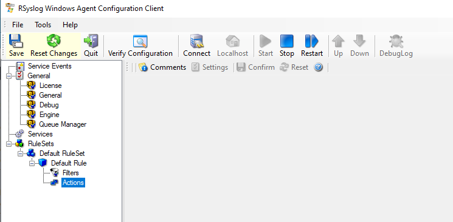
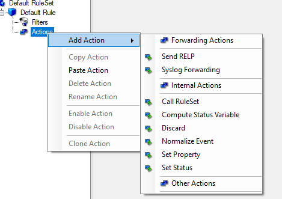
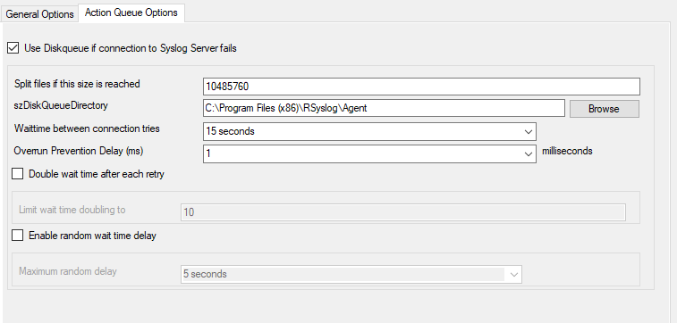

# Configuration de RELP dans un agent RSYSLOG Windows

## 1. Prérequis

* l'agent RSYSLOG de Adiscon doit être installé et opérationnel
* (option) PKI déployée
  * Fichier d'authorité de certification: `ca.crt`
  * Fichier certificat du serveur: `$HOSTNAME.crt`
  * Fichier non chiffré de clé du certificat de serveur: `$HOSTNAME.key`

## 2. Modèle de configuration

1. A partir de la console 

2. Bouton droit sur "Actions" dans "RuleSets/Default Rule Set/Default Rule"
3. Sélectonnez "Add Action" puis "Send RELP"

4. Dans le menu "Send RELP"

  1. Saisissez le nom du serveur dans le champs "RELP Servername"
  2. Saisissez le format suivant dans "Message Format" : `%sourceproc%.%catname%: %syslogpriority_text%: date=%timereported:1:10%T%timereported:12:19% source=%source% msgid=%id% user=%user% msg=%msg:::spacecc,compressspace%%$CRLF%`
  3. Saisissez les informations TLS dans le zone "Enable SSL/TLS Encryption" une fois l'option cochée:
     1. Définir "TLS Mode" à "Use Certificate"
     2. Choisir le fichier PEM de l'authorité de certification dans "Select common CA PEM"
     3. Choisir le fichier PEM du certificat de l'agent dans "Select Certificate PEM"
     4. Choisir le fichier PEM de la clé privé de l'agent dans "Select Key PEM"
5. Allez dans l'onget "Action Queue Options" 

6. Validez l'option "Use Diskqueue ..."

7. Validez la saisie avec le bouton "Confirm"

8. Redémarrer le service RSYSLOG
